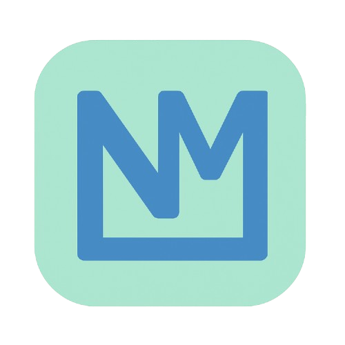

# ⚡ Portafolio de Néstor Montenegro

Un portafolio web moderno y de alto rendimiento para Néstor Montenegro, Desarrollador Full Stack especializado en el ecosistema React. Diseñado con un enfoque en estética premium, animaciones fluidas y optimización técnica.



## 🌟 Características Destacadas

- **🎨 Diseño Premium**: Interfaz "Dark Mode" con estética Glassmorphism, degradados vibrantes en tonos púrpura y efectos de neón.
- **📱 Totalmente Responsivo**: Experiencia nativa en móviles con menú de navegación táctil y layouts adaptables.
- **⚡ Alto Rendimiento**: 
  - **Lazy Loading**: Carga diferida de secciones pesadas para un inicio instantáneo.
  - **Code Splitting**: Optimización de bundles con Vite.
- **✨ Animaciones Avanzadas**: 
  - Efectos de escritura automática (`typewriter-effect`).
  - Efectos de inclinación 3D (`react-parallax-tilt`).
  - Transiciones suaves entre secciones con `framer-motion`.
- **🛠️ Arquitectura Limpia**: Código modular, tipado estricto con TypeScript y componentes reutilizables.

## 🛠️ Stack Tecnológico

### Core
- **React 19** - Biblioteca de UI
- **TypeScript** - Seguridad de tipos y escalabilidad
- **Vite** - Build tool de última generación

### Estilos & UI
- **CSS3 Variables** - Sistema de diseño flexible
- **Framer Motion** - Motor de animaciones
- **Lucide React & React Icons** - Iconografía vectorial
- **Glassmorphism** - Estilo visual translúcido

### Librerías Adicionales
- `react-parallax-tilt` - Efectos interactivos en imágenes
- `typewriter-effect` - Animaciones de texto dinámicas

## 📱 Secciones

1. **🏠 Hero**: Presentación impactante con efecto parallax y texto dinámico.
2. **👨‍💻 Sobre Mí**: Narrativa profesional, estadísticas clave y grid de habilidades categorizadas.
3. **🚀 Proyectos**: Grid moderno de tarjetas con efectos hover, stack tecnológico y enlaces a demos/código.
4. **💼 Experiencia**: Timeline vertical detallando trayectoria profesional.
5. **📞 Contacto**: Información directa y enlaces a redes sociales.

## 🎨 Sistema de Diseño

El proyecto utiliza un sistema de variables CSS para mantener la consistencia:

```css
:root {
  --primary-purple: #8b5cf6;       /* Color principal */
  --primary-purple-light: #a78bfa; /* Acentos brillantes */
  --primary-purple-dark: #7c3aed;  /* Profundidad */
  --bg-dark: #0f0f23;             /* Fondo principal */
  --bg-card: rgba(30, 30, 63, 0.5); /* Tarjetas translúcidas */
  --text-light: #ffffff;          /* Texto principal */
}
```

## 🚀 Instalación y Desarrollo

1. **Clonar el repositorio**
```bash
git clone https://github.com/nestord23/portafolio.git
cd portafolio
```

2. **Instalar dependencias**
```bash
npm install
```

3. **Iniciar servidor de desarrollo**
```bash
npm run dev
```

4. **Construir para producción**
```bash
npm run build
```

## 📧 Contacto

- **Email**: realdanii135@gmail.com
- **Teléfono**: +502 57886144
- **LinkedIn**: [in/Nestor](https://linkedin.com/in/Nestor)
- **GitHub**: [github.com/nestord23](https://github.com/nestord23)

---

**Desarrollado con ❤️ por Néstor Montenegro**
*"Transformando ideas en experiencias digitales memorables"*
